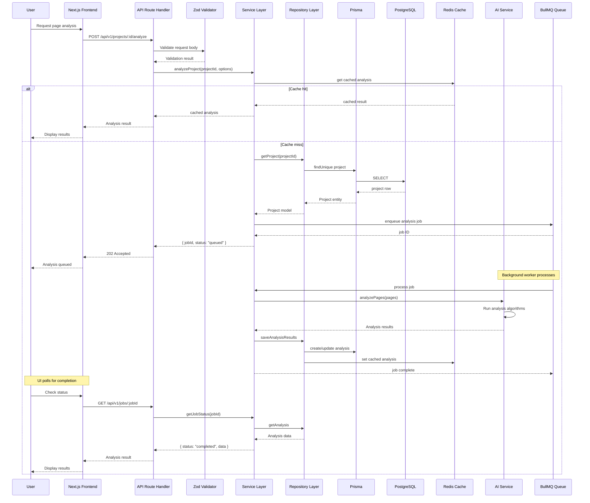
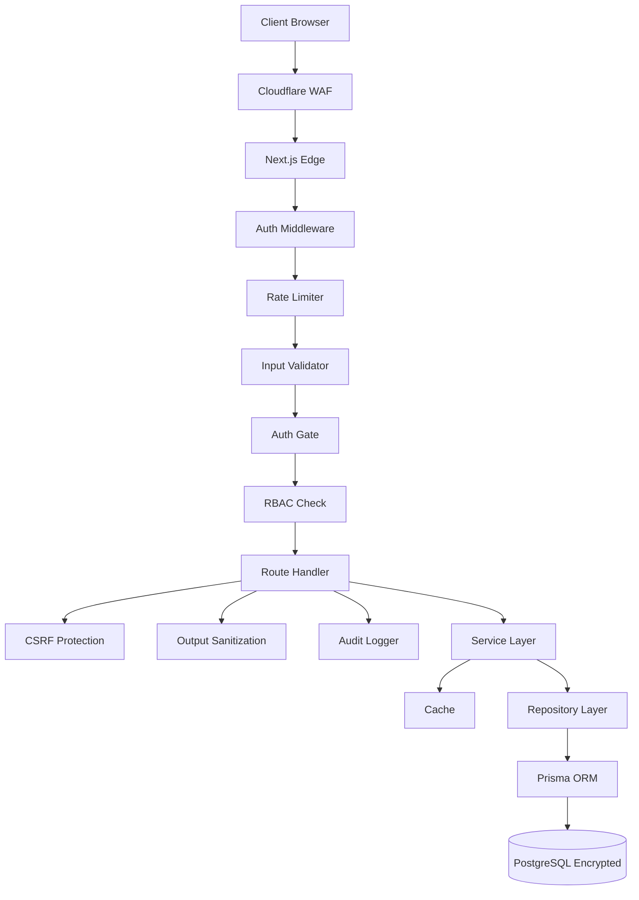
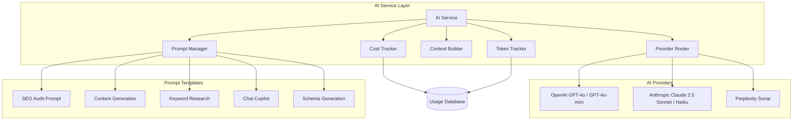
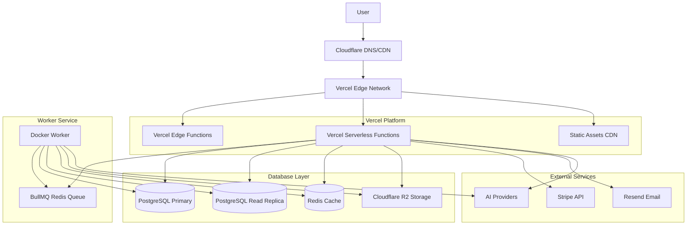

# Lade Stack AI SEO Copilot — System Design Document

## 1. System Architecture Overview

```mermaid
C4Context
  Person(user, "User", "SEO professional, content strategist, agency owner")
  Person(admin, "Admin", "Platform administrator")

  System_Boundary(seo_platform, "Lade Stack AI SEO Copilot") {
    System(Frontend, "Next.js Frontend", "React, TypeScript, Tailwind CSS")
    System(ApiGateway, "API Gateway", "Next.js Route Handlers + Middleware")
    System(Auth, "Auth Service", "NextAuth.js + RBAC")
    
    System_Boundary(backend, "Backend Services") {
      System(Repos, "Repository Layer", "Data access abstraction via Prisma")
      System(Services, "Service Layer", "Business logic")
      System(AIService, "AI Service", "Multi-provider AI orchestration")
      System(Jobs, "Background Jobs", "Queue-based processing")
      System(Cache, "Cache Layer", "Redis - multi-tier caching")
    }
    
    System_Boundary(data, "Data Layer") {
      System(DB, "PostgreSQL", "Primary database via Prisma ORM")
      System(Queue, "Job Queue", "BullMQ / Redis-based queue")
      System(Search, "Vector Store", "pgvector for semantic search")
    }
    
    System_Boundary(infra, "Infrastructure") {
      System(CDN, "CDN", "Cloudflare / Vercel Edge")
      System(Storage, "Object Storage", "S3-compatible file storage")
      System(Observability, "Observability", "Logs, metrics, traces")
    }
  }
  
  System_Ext(AIProviders, "AI Providers", "OpenAI, Anthropic, Google, Local")
  System_Ext(Email, "Email Service", "Resend / SendGrid")
  System_Ext(Payments, "Payment Provider", "Stripe")
  System_Ext(ExternalAPIs, "External APIs", "Google Search Console, etc.")

  Rel(user, Frontend, "HTTPS", "Browser")
  Rel(user, ApiGateway, "HTTPS", "API calls")
  Rel(admin, Frontend, "HTTPS", "Admin access")
  Rel(Frontend, ApiGateway, "Internal API routes")
  Rel(ApiGateway, Auth, "Authentication")
  Rel(ApiGateway, Services, "Business logic delegation")
  Rel(ApiGateway, AIService, "AI operations")
  Rel(Services, Repos, "Data access")
  Rel(Repos, DB, "Prisma ORM")
  Rel(AIService, AIProviders, "API calls")
  Rel(Jobs, Queue, "Job scheduling")
  Rel(Services, Cache, "Caching")
  Rel(Backend, Email, "Email notifications")
  Rel(Backend, Payments, "Stripe API")
  Rel(Backend, ExternalAPIs, "3rd party APIs")
  Rel(Frontend, CDN, "Static assets")
  Rel(Storage, Backend, "File operations")
  Rel(Services, Search, "Vector search")
```

## 2. High-Level Architecture

### 2.1 Architecture Style

**Hybrid: Modular Monolith + Future Microservices**

The platform starts as a well-structured modular monolith deployed on Vercel (frontend + API routes), with background workers on a separate service. This architecture follows Clean Architecture with strict layer separation:

- **Presentation Layer**: Next.js App Router (React Server Components + Client Components)
- **API Layer**: Next.js Route Handlers with rate limiting, validation, auth
- **Application Layer**: Service layer with business logic
- **Infrastructure Layer**: Repositories, cache, queue, external services
- **Domain Layer**: Core business entities and rules

### 2.2 Technology Stack

| Layer | Technology | Justification |
|-------|-----------|---------------|
| Frontend Framework | Next.js 15 (App Router) | SSR, streaming, RSCs, Vercel deployment |
| UI Library | React 19 | Latest concurrent features |
| Styling | Tailwind CSS v4 | Utility-first, fast, consistent |
| Component Library | shadcn/ui | Radix primitives, accessible, customizable |
| State Management (Server) | TanStack Query v5 | Caching, deduplication, optimistic updates |
| State Management (Client) | Zustand | Lightweight, TypeScript-first |
| Forms | React Hook Form + Zod | Performant, validated forms |
| Language | TypeScript 5.x (strict mode) | Type safety everywhere |
| ORM | Prisma 6 | Type-safe database access |
| Database | PostgreSQL 16 | Mature, extensible, pgvector |
| Cache | Redis (Upstash/Vercel KV) | Low-latency caching, rate limiting |
| Queue | BullMQ | Redis-based, reliable, delayed jobs |
| Auth | NextAuth.js v5 | Flexible auth providers |
| AI SDK | Native OpenAI + Anthropic SDKs | Direct provider integration via ai-core |
| Payments | Stripe | Billing, subscriptions, invoices |
| Email | Resend | Transactional email, React Email |
| Background Jobs | Dedicated worker (Vercel or Docker) | Heavy processing |
| Search | pgvector | Semantic search, AI embeddings |
| File Storage | S3 (AWS/Cloudflare R2) | Scalable object storage |
| CDN | Cloudflare / Vercel Edge | Global caching |
| Observability | Sentry, OpenTelemetry, Logflare | Error tracking, traces, logs |
| CI/CD | GitHub Actions | Automated pipelines |
| Testing | Vitest, Playwright, Testing Library | Full test pyramid |

## 3. Data Flow Architecture



## 4. Folder Structure

```
/
├── .github/
│   └── workflows/
│       ├── ci.yml                    # CI pipeline
│       ├── cd.yml                    # CD pipeline
│       ├── lint.yml                  # Lint checks
│       ├── test.yml                  # Test suite
│       └── security.yml              # Security scanning
│
├── apps/
│   └── web/                          # Next.js frontend
│       ├── app/
│       │   ├── (auth)/               # Auth routes layout
│       │   │   ├── login/
│       │   │   ├── register/
│       │   │   └── forgot-password/
│       │   ├── (dashboard)/          # Dashboard layout
│       │   │   ├── dashboard/
│       │   │   ├── projects/
│       │   │   ├── analysis/
│       │   │   ├── keywords/
│       │   │   ├── content/
│       │   │   ├── reports/
│       │   │   ├── settings/
│       │   │   ├── billing/
│       │   │   └── admin/
│       │   ├── api/                  # API Route Handlers
│       │   │   └── v1/
│       │   │       ├── auth/
│       │   │       ├── projects/
│       │   │       ├── analysis/
│       │   │       ├── keywords/
│       │   │       ├── content/
│       │   │       ├── ai/
│       │   │       ├── reports/
│       │   │       ├── billing/
│       │   │       ├── admin/
│       │   │       ├── webhooks/
│       │   │       └── health/
│       │   ├── layout.tsx            # Root layout
│       │   └── page.tsx              # Landing page
│       │
│       ├── components/
│       │   ├── ui/                   # shadcn/ui primitives
│       │   ├── layout/               # App shell components
│       │   │   ├── sidebar.tsx
│       │   │   ├── navbar.tsx
│       │   │   ├── breadcrumb.tsx
│       │   │   └── app-shell.tsx
│       │   ├── forms/                # Form components
│       │   │   ├── project-form.tsx
│       │   │   ├── keyword-form.tsx
│       │   │   └── settings-form.tsx
│       │   ├── data/                 # Data display components
│       │   │   ├── data-table.tsx
│       │   │   ├── metric-card.tsx
│       │   │   └── stat-card.tsx
│       │   ├── charts/               # Chart components
│       │   │   ├── line-chart.tsx
│       │   │   ├── bar-chart.tsx
│       │   │   ├── pie-chart.tsx
│       │   │   └── area-chart.tsx
│       │   ├── seo/                  # SEO-specific components
│       │   │   ├── audit-summary.tsx
│       │   │   ├── keyword-table.tsx
│       │   │   ├── content-editor.tsx
│       │   │   ├── serp-preview.tsx
│       │   │   └── score-gauge.tsx
│       │   ├── ai/                   # AI components
│       │   │   ├── ai-copilot.tsx
│       │   │   ├── ai-chat.tsx
│       │   │   ├── ai-generator.tsx
│       │   │   └── streaming-text.tsx
│       │   ├── billing/              # Billing components
│       │   │   ├── subscription-card.tsx
│       │   │   ├── pricing-table.tsx
│       │   │   ├── invoice-list.tsx
│       │   │   └── payment-method.tsx
│       │   ├── admin/                # Admin components
│       │   │   ├── user-table.tsx
│       │   │   ├── feature-flags.tsx
│       │   │   └── system-config.tsx
│       │   ├── shared/               # Shared components
│       │   │   ├── loading.tsx
│       │   │   ├── error-boundary.tsx
│       │   │   ├── empty-state.tsx
│       │   │   ├── pagination.tsx
│       │   │   ├── confirm-dialog.tsx
│       │   │   └── toast.tsx
│       │   └── providers/            # React context providers
│       │       ├── auth-provider.tsx
│       │       ├── theme-provider.tsx
│       │       ├── query-provider.tsx
│       │       └── ai-provider.tsx
│       │
│       ├── hooks/                    # Custom hooks
│       │   ├── use-auth.ts
│       │   ├── use-projects.ts
│       │   ├── use-analysis.ts
│       │   ├── use-keywords.ts
│       │   ├── use-content.ts
│       │   ├── use-ai.ts
│       │   ├── use-billing.ts
│       │   ├── use-debounce.ts
│       │   ├── use-media-query.ts
│       │   └── use-pagination.ts
│       │
│       ├── lib/                      # Frontend utilities
│       │   ├── api-client.ts         # API client (fetch wrapper)
│       │   ├── auth.ts               # Auth utilities
│       │   ├── permissions.ts        # Permission checks
│       │   ├── utils.ts              # General utilities
│       │   ├── constants.ts          # Constants
│       │   └── formatters.ts         # Number, date formatters
│       │
│       ├── stores/                   # Zustand stores
│       │   ├── auth-store.ts
│       │   ├── project-store.ts
│       │   ├── ui-store.ts
│       │   └── ai-store.ts
│       │
│       ├── types/                    # TypeScript types
│       │   ├── api.ts
│       │   ├── models.ts
│       │   ├── seo.ts
│       │   └── billing.ts
│       │
│       ├── public/
│       │   ├── images/
│       │   └── icons/
│       │
│       ├── messages/                 # i18n messages (future)
│       │   └── en.json
│       │
│       ├── next.config.ts
│       ├── tailwind.config.ts
│       ├── tsconfig.json
│       ├── vitest.config.ts
│       └── package.json
│
├── packages/
│   ├── shared/                       # Shared code between apps
│   │   ├── src/
│   │   │   ├── types/
│   │   │   ├── validators/
│   │   │   ├── constants/
│   │   │   ├── permissions/
│   │   │   ├── errors/
│   │   │   └── utils/
│   │   └── package.json
│   │
│   ├── database/                     # Prisma schema and migrations
│   │   ├── prisma/
│   │   │   ├── schema/
│   │   │   │   ├── base/
│   │   │   │   │   ├── user.prisma
│   │   │   │   │   ├── project.prisma
│   │   │   │   │   ├── analysis.prisma
│   │   │   │   │   ├── keyword.prisma
│   │   │   │   │   ├── content.prisma
│   │   │   │   │   ├── report.prisma
│   │   │   │   │   ├── billing.prisma
│   │   │   │   │   ├── admin.prisma
│   │   │   │   │   └── ai.prisma
│   │   │   │   ├── extensions/
│   │   │   │   │   └── audit.prisma
│   │   │   │   └── index.prisma
│   │   │   ├── migrations/
│   │   │   └── seed.ts
│   │   ├── src/
│   │   │   ├── client.ts             # Prisma client singleton
│   │   │   ├── repositories/
│   │   │   │   ├── base.repository.ts
│   │   │   │   ├── user.repository.ts
│   │   │   │   ├── project.repository.ts
│   │   │   │   ├── analysis.repository.ts
│   │   │   │   ├── keyword.repository.ts
│   │   │   │   ├── content.repository.ts
│   │   │   │   ├── report.repository.ts
│   │   │   │   ├── billing.repository.ts
│   │   │   │   └── admin.repository.ts
│   │   │   └── index.ts
│   │   └── package.json
│   │
│   ├── services/                     # Business logic services
│   │   ├── src/
│   │   │   ├── auth/
│   │   │   │   ├── auth.service.ts
│   │   │   │   └── permissions.service.ts
│   │   │   ├── project.service.ts
│   │   │   ├── analysis.service.ts
│   │   │   ├── seo-scorer.service.ts
│   │   │   ├── keyword.service.ts
│   │   │   ├── content.service.ts
│   │   │   ├── report.service.ts
│   │   │   ├── notification.service.ts
│   │   │   ├── billing.service.ts
│   │   │   ├── admin.service.ts
│   │   │   ├── cache.service.ts
│   │   │   └── index.ts
│   │   └── package.json
│   │
│   ├── ai-core/                      # AI infrastructure
│   │   ├── src/
│   │   │   ├── providers/
│   │   │   │   ├── ai-provider.interface.ts
│   │   │   │   ├── openai.provider.ts
│   │   │   │   └── anthropic.provider.ts
│   │   │   ├── prompts/
│   │   │   │   └── templates.ts
│   │   │   ├── model-registry.ts
│   │   │   ├── cost-tracker.ts
│   │   │   ├── prompt-manager.ts
│   │   │   └── index.ts
│   │   └── package.json
│   │
│   └── config/                       # Shared configuration
│       ├── src/
│       │   ├── env.ts
│       │   ├── logger.ts
│       │   ├── errors.ts
│       │   ├── rate-limiter.ts
│       │   └── security.ts
│       └── package.json
│
├── workers/                          # Background workers
│   ├── analysis-worker/
│   ├── keyword-worker/
│   ├── content-worker/
│   ├── report-worker/
│   └── shared/
│
├── scripts/                          # DevOps & utility scripts
│   ├── seed.ts
│   ├── migrate.ts
│   ├── backup.ts
│   └── health-check.ts
│
├── tests/                            # Test suites
│   ├── unit/
│   ├── integration/
│   ├── e2e/
│   └── fixtures/
│
├── docs/                             # Documentation
│   ├── architecture.md
│   ├── api.md
│   ├── deployment.md
│   ├── operations.md
│   └── runbooks/
│
├── docker/
│   ├── Dockerfile.web
│   ├── Dockerfile.worker
│   └── docker-compose.yml
│
├── infra/                            # Infrastructure as Code
│   ├── terraform/
│   │   ├── modules/
│   │   └── environments/
│   └── k8s/
│       ├── web-deployment.yaml
│       ├── worker-deployment.yaml
│       ├── service.yaml
│       └── configmap.yaml
│
├── turbo.json
├── package.json (workspace root)
├── tsconfig.base.json
├── .eslintrc.js
├── .prettierrc
├── .env.example
├── .gitignore
├── LICENSE
└── README.md
```

## 5. Database ER Diagram

```mermaid
erDiagram
    User ||--o{ Project : owns
    User ||--o{ ProjectMember : member
    User ||--o{ ApiKey : has
    User ||--o{ Notification : receives
    User ||--o{ Subscription : has
    User ||--o{ AiConversation : has
    User ||--o{ AuditLog : triggers

    Project ||--o{ ProjectMember : has
    Project ||--o{ Page : contains
    Project ||--o{ Analysis : has
    Project ||--o{ Keyword : targets
    Project ||--o{ Content : has
    Project ||--o{ Competitor : watches
    Project ||--o{ Report : generates
    Project ||--o{ AiContentGeneration : uses

    Page ||--o{ PageAnalysis : has
    Page ||--o{ PageIssue : has

    Analysis ||--o{ PageAnalysis : includes

    Keyword ||--o{ KeywordRanking : has
    Keyword ||--o{ KeywordCluster : belongs

    Content ||--o{ ContentVersion : versions

    AiContentGeneration ||--o{ AiContentResult : produces

    Subscription ||--o{ Invoice : has
    Subscription ||--o{ UsageRecord : tracks
    User ||--o{ PaymentMethod : has

    Project ||--o{ AuditLog : has
    User ||--o{ Session : has

    User {
        string id PK
        string email UK
        string passwordHash
        string name
        string avatarUrl
        string role "user | admin"
        string status "active | suspended | inactive"
        datetime emailVerifiedAt
        datetime createdAt
        datetime updatedAt
        datetime deletedAt
    }

    Project {
        string id PK
        string name
        string domain UK
        string description
        string settings "JSON settings"
        string status "active | archived | deleted"
        string userId FK
        datetime lastAnalyzedAt
        datetime createdAt
        datetime updatedAt
        datetime deletedAt
    }

    ProjectMember {
        string id PK
        string projectId FK
        string userId FK
        string role "owner | editor | viewer"
        datetime createdAt
        datetime updatedAt
    }

    Page {
        string id PK
        string projectId FK
        string url UK
        string title
        int statusCode
        string contentType
        int wordCount
        string checksum "content hash for change detection"
        datetime lastCrawledAt
        datetime createdAt
        datetime updatedAt
    }

    Analysis {
        string id PK
        string projectId FK
        string type "full | quick | scheduled"
        string status "queued | running | completed | failed"
        string trigger "manual | scheduled | webhook"
        int pagesAnalyzed
        int issuesFound
        float overallScore
        json summary
        datetime completedAt
        datetime createdAt
        datetime updatedAt
    }

    PageAnalysis {
        string id PK
        string pageId FK
        string analysisId FK
        float score
        json meta "title, description, og tags"
        json headings "h1-h6 analysis"
        json images "img analysis with alt text"
        json links "internal, external, broken"
        json performance "CWV data"
        json structuredData "schema.org analysis"
        json accessibility "a11y issues"
        datetime createdAt
    }

    PageIssue {
        string id PK
        string pageAnalysisId FK
        string type "error | warning | info"
        string category "meta | heading | image | link | perf | schema | a11y"
        string code "unique issue identifier"
        string message
        string selector "CSS selector of element"
        string recommendation
        int impact "1-10 severity"
        datetime createdAt
    }

    Keyword {
        string id PK
        string projectId FK
        string keyword
        string intent "informational | navigational | commercial | transactional"
        float searchVolume
        float difficulty "0-100"
        float cpc
        float competition
        json serpFeatures
        datetime createdAt
        datetime updatedAt
    }

    KeywordCluster {
        string id PK
        string projectId FK
        string name
        string keywords "JSON array of keyword IDs"
        string topic
        float totalVolume
        float avgDifficulty
        datetime createdAt
    }

    KeywordRanking {
        string id PK
        string keywordId FK
        int position
        string url
        string searchEngine "google | bing | chatgpt | perplexity"
        string location "country code"
        datetime trackedAt
        datetime createdAt
    }

    Content {
        string id PK
        string projectId FK
        string type "blog | landing | product | schema | social | meta"
        string title
        string slug
        string status "draft | published | archived"
        string content "main content body"
        string metaTitle
        string metaDescription
        string targetKeyword
        json seoScore "content SEO score details"
        float overallScore
        string createdBy FK
        string updatedBy FK
        datetime publishedAt
        datetime createdAt
        datetime updatedAt
    }

    ContentVersion {
        string id PK
        string contentId FK
        int version
        string content
        string metaTitle
        string metaDescription
        string changeNote
        string createdBy FK
        datetime createdAt
    }

    Competitor {
        string id PK
        string projectId FK
        string domain
        string name
        json metrics "traffic, keywords, etc"
        datetime lastAnalyzedAt
        datetime createdAt
        datetime updatedAt
    }

    AiConversation {
        string id PK
        string userId FK
        string projectId FK
        string title
        string model
        int messageCount
        int tokenCount
        datetime createdAt
        datetime updatedAt
    }

    AiMessage {
        string id PK
        string conversationId FK
        string role "user | assistant | system"
        string content
        json metadata "tokens, model, latency"
        int tokenCount
        datetime createdAt
    }

    AiContentGeneration {
        string id PK
        string userId FK
        string projectId FK
        string type "blog | meta | schema | landing | faq | social"
        string status "pending | processing | completed | failed"
        string prompt "input prompt"
        string result "generated content"
        string model
        int inputTokens
        int outputTokens
        float cost
        float latency
        datetime createdAt
        datetime completedAt
    }

    Report {
        string id PK
        string projectId FK
        string name
        string type "pdf | csv | xlsx | html"
        string status "generating | completed | failed"
        string config "JSON report configuration"
        string fileUrl
        string schedule "none | daily | weekly | monthly"
        datetime lastGeneratedAt
        datetime createdAt
        datetime updatedAt
    }

    Subscription {
        string id PK
        string userId FK
        string plan "free | pro | business | enterprise"
        string status "active | past_due | canceled | expired"
        string stripeSubscriptionId
        string stripeCustomerId
        datetime currentPeriodStart
        datetime currentPeriodEnd
        int maxProjects
        int maxPagesPerProject
        int maxKeywords
        int aiCredits "monthly credit allowance"
        int apiCallsLimit
        datetime canceledAt
        datetime createdAt
        datetime updatedAt
    }

    UsageRecord {
        string id PK
        string userId FK
        string type "ai_credit | api_call | page_analysis | report"
        int quantity
        string description
        datetime createdAt
    }

    Invoice {
        string id PK
        string userId FK
        string subscriptionId FK
        string stripeInvoiceId
        string status "draft | open | paid | uncollectible | void"
        float amount
        float amountPaid
        float tax
        string currency
        string invoiceUrl
        datetime dueDate
        datetime paidAt
        datetime createdAt
    }

    PaymentMethod {
        string id PK
        string userId FK
        string stripePaymentMethodId
        string type "card | us_bank_account"
        string brand
        string last4
        int expMonth
        int expYear
        boolean isDefault
        datetime createdAt
    }

    ApiKey {
        string id PK
        string userId FK
        string name
        string key "hashed key"
        string permissions "comma-separated scopes"
        datetime lastUsedAt
        datetime expiresAt
        datetime createdAt
        datetime revokedAt
    }

    Notification {
        string id PK
        string userId FK
        string type "alert | report | billing | system"
        string title
        string message
        json data "additional payload"
        boolean read
        datetime readAt
        datetime createdAt
    }

    FeatureFlag {
        string id PK
        string name UK
        string description
        boolean enabled
        string rules "JSON targeting rules"
        datetime createdAt
        datetime updatedAt
    }

    AuditLog {
        string id PK
        string userId FK
        string projectId FK
        string action
        string entity
        string entityId
        json before
        json after
        string ipAddress
        string userAgent
        datetime createdAt
    }

    Session {
        string id PK
        string userId FK
        string token
        string ipAddress
        string userAgent
        datetime expiresAt
        datetime createdAt
        datetime revokedAt
    }
```



## 6. API Architecture

### 6.1 API Route Structure

```
/api/v1/
│
├── auth/
│   ├── POST   /register
│   ├── POST   /login
│   ├── POST   /logout
│   ├── POST   /forgot-password
│   ├── POST   /reset-password
│   ├── POST   /verify-email
│   └── GET    /session
│
├── users/
│   ├── GET    /me
│   ├── PATCH  /me
│   ├── GET    /me/api-keys
│   ├── POST   /me/api-keys
│   ├── DELETE /me/api-keys/:id
│   └── DELETE /me
│
├── projects/
│   ├── GET    / (paginated, filtered, sorted)
│   ├── POST   / (create)
│   ├── GET    /:id
│   ├── PATCH  /:id
│   ├── DELETE /:id (soft)
│   ├── POST   /:id/archive
│   ├── POST   /:id/restore
│   ├── GET    /:id/pages
│   ├── GET    /:id/members
│   ├── POST   /:id/members
│   ├── DELETE /:id/members/:memberId
│   └── PATCH  /:id/members/:memberId
│
├── analysis/
│   ├── POST   /projects/:projectId (trigger)
│   ├── GET    /projects/:projectId (list)
│   ├── GET    /:id (detail)
│   ├── GET    /:id/issues
│   ├── GET    /:id/pages
│   ├── GET    /:id/summary
│   ├── GET    /projects/:projectId/latest
│   └── GET    /projects/:projectId/trend
│
├── keywords/
│   ├── GET    /projects/:projectId (list)
│   ├── POST   /projects/:projectId (add)
│   ├── POST   /projects/:projectId/research
│   ├── POST   /projects/:projectId/cluster
│   ├── GET    /:id
│   ├── PATCH  /:id
│   ├── DELETE /:id
│   ├── GET    /:id/rankings
│   ├── POST   /:id/track
│   ├── GET    /projects/:projectId/gaps
│   ├── POST   /projects/:projectId/import
│   └── GET    /projects/:projectId/suggestions
│
├── content/
│   ├── GET    /projects/:projectId (list)
│   ├── POST   /projects/:projectId (create)
│   ├── GET    /:id
│   ├── PATCH  /:id
│   ├── DELETE /:id
│   ├── GET    /:id/versions
│   ├── POST   /:id/versions
│   ├── POST   /:id/analyze
│   ├── POST   /:id/optimize
│   └── POST   /projects/:projectId/generate
│
├── ai/
│   ├── POST   /chat (streaming)
│   ├── POST   /generate
│   ├── POST   /analyze
│   ├── POST   /optimize
│   ├── GET    /conversations
│   ├── GET    /conversations/:id
│   ├── DELETE /conversations/:id
│   ├── GET    /usage
│   ├── GET    /costs
│   └── GET    /models
│
├── reports/
│   ├── GET    /projects/:projectId (list)
│   ├── POST   /projects/:projectId (generate)
│   ├── GET    /:id
│   ├── GET    /:id/download
│   ├── POST   /:id/schedule
│   ├── DELETE /:id/schedule
│   └── DELETE /:id
│
├── competitors/
│   ├── GET    /projects/:projectId (list)
│   ├── POST   /projects/:projectId (add)
│   ├── GET    /:id
│   ├── PATCH  /:id
│   ├── DELETE /:id
│   ├── POST   /:id/analyze
│   └── GET    /:id/comparison
│
├── billing/
│   ├── GET    /subscription
│   ├── PATCH  /subscription
│   ├── POST   /subscription/cancel
│   ├── POST   /subscription/reactivate
│   ├── GET    /invoices
│   ├── GET    /invoices/:id
│   ├── GET    /payment-methods
│   ├── POST   /payment-methods
│   ├── DELETE /payment-methods/:id
│   ├── GET    /usage
│   ├── GET    /plans
│   └── POST   /change-plan
│
├── notifications/
│   ├── GET    / (list)
│   ├── PATCH  /:id/read
│   ├── POST   /read-all
│   ├── GET    /preferences
│   └── PATCH  /preferences
│
├── admin/
│   ├── GET    /users
│   ├── GET    /users/:id
│   ├── PATCH  /users/:id
│   ├── POST   /users/:id/suspend
│   ├── POST   /users/:id/activate
│   ├── GET    /audit-logs
│   ├── GET    /audit-logs/:id
│   ├── GET    /feature-flags
│   ├── PATCH  /feature-flags/:id
│   ├── GET    /stats
│   ├── GET    /analytics
│   └── POST   /announcements
│
├── webhooks/
│   ├── POST   /stripe
│   ├── POST   /resend
│   └── POST   /slack
│
├── health/
│   ├── GET    / (basic health)
│   ├── GET    /ready (readiness)
│   ├── GET    /live (liveness)
│   └── GET    /deep (full dependency check)
│
└── settings/
    ├── GET    / (all settings)
    ├── PATCH  /profile
    ├── PATCH  /password
    ├── PATCH  /notifications
    └── DELETE /account
```

### 6.2 API Response Format

```typescript
// Success response
{
  "status": "success",
  "data": T,
  "meta": {
    "page": 1,
    "pageSize": 50,
    "total": 1234,
    "totalPages": 25
  }
}

// Error response
{
  "status": "error",
  "error": {
    "code": "VALIDATION_ERROR",
    "message": "Invalid input data",
    "details": [
      { "field": "email", "message": "Invalid email format" }
    ],
    "requestId": "req_abc123"
  }
}
```

### 6.3 Standard HTTP Status Codes

- 200: Success
- 201: Created
- 202: Accepted (for async operations)
- 204: No Content
- 400: Bad Request
- 401: Unauthorized
- 403: Forbidden
- 404: Not Found
- 409: Conflict
- 422: Unprocessable Entity
- 429: Too Many Requests
- 500: Internal Server Error
- 502: Bad Gateway
- 503: Service Unavailable

## 7. Security Architecture



## 8. AI Architecture



## 9. Deployment Architecture



## 10. Caching Strategy

| Cache Layer | Technology | What | TTL | Invalidation |
|------------|-----------|------|-----|-------------|
| Browser Cache | Cache-Control headers | Static assets | 1 year | Content hash |
| CDN Cache | Cloudflare | Public pages, assets | Variable | Purge API |
| Edge Cache | Vercel Edge Config | User config, feature flags | 60s | Direct set |
| Application Cache | Redis | API responses, user data | 5-300s | Key-based |
| Database Cache | PostgreSQL | Query results | Implicit | Row changes |
| React Cache | TanStack Query | Server state | Configurable | Refetch/Mutation |
| React Cache | Next.js unstable_cache | RSC data | Revalidate | Time/Tag |

## 11. Observability Stack

| Tool | Purpose |
|------|---------|
| Sentry | Error tracking, performance monitoring |
| OpenTelemetry | Distributed tracing |
| Logflare / Axiom | Structured log aggregation |
| Grafana | Dashboards and metrics visualization |
| Prometheus | Metrics collection |
| Checkly | Synthetic monitoring |
| PostHog | Product analytics, feature flags |
| uptime.com | Uptime monitoring |

## 12. Rate Limiting Strategy

| Limit | Scope | Window | Max |
|-------|-------|--------|-----|
| General API | Per user | 1 minute | 100 |
| AI Chat | Per user | 1 minute | 20 |
| AI Generation | Per user | 1 hour | 50 |
| Page Analysis | Per project | 1 hour | 10 |
| Crawl | Per project | 1 hour | 3 |
| Login | Per IP | 15 minutes | 5 |
| Register | Per IP | 1 hour | 3 |
| Export | Per user | 1 hour | 10 |
| Webhook | Per IP | 1 minute | 30 |
